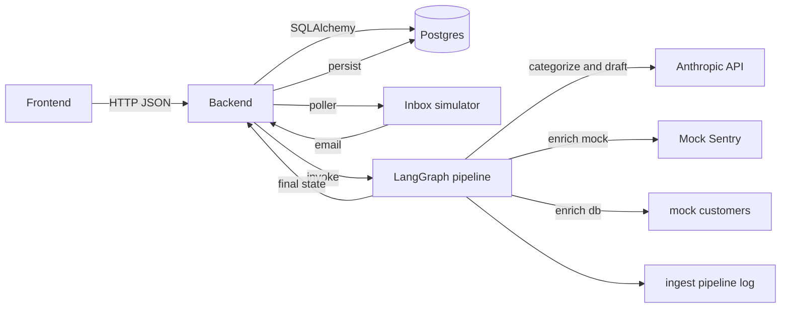

# Support Ticketing MVP (Inbox Simulator + AI Triage)

<!-- markdownlint-disable MD033 -->

End-to-end MVP that simulates an email inbox, turns “emails” into tickets, enriches/triages them through a **LangGraph** pipeline, persists everything to **Postgres**, and renders it in a **Next.js** dashboard.


## VERY IMPORTANT DISCLAIMER (Inbox/Email Simulation)

This project is **NOT** connected to a real Outlook/Gmail inbox and it does **NOT** send real emails.

- **Simulated inbox**: incoming emails are produced by a background poller that picks local samples from `tickets/ticket_*.txt` (or falls back to internal mock emails).
- **Sample data**: the dataset is anonymized/tagged and used only to simulate support requests.
- **“Outlook thread parity” is demonstrational**: when you reply from the UI, the backend prepares an email with `In-Reply-To` and `References` headers (Outlook-style threading), but **SMTP sending is disabled** for safety.
- **No authentication**: admin/simulation endpoints are open because this is a local MVP.

A real integration would require IMAP/SMTP or Microsoft Graph (plus secure credential storage, rate limiting, audit logs, etc.).

## Screenshots

### AI Pipeline (overview)


### DB Schema (overview)


### Conversation / Reply


### Wireframe (Excalidraw)


## Architecture



## Repository layout

```text
.
├─ docker-compose.yml
├─ README.md
├─ backend/
│  ├─ main.py
│  ├─ database.py
│  └─ ingest_email_engine/
│     ├─ graph.py
│     ├─ state.py
│     ├─ llm.py
│     ├─ logger.py
│     └─ nodes/
├─ frontend/
│  └─ src/app/page.tsx
├─ tickets/                 # sample dataset (ticket_*.txt)
└─ materials/               # documentation images
```

## Quickstart (Docker - recommended)

### Prerequisites

- Docker Desktop (with `docker compose`)

### 1) Configure environment variables

Create/edit a `.env` file at repo root (do not commit keys):

```dotenv
# LLM (Anthropic)
ANTHROPIC_API_KEY=...
ANTHROPIC_MODEL=claude-3-haiku-20240307

# Postgres (optional; if empty it uses docker-compose defaults)
POSTGRES_USER=admin
POSTGRES_PASSWORD=password123
POSTGRES_DB=support_db
```

### 2) Start the stack

```bash
docker compose up --build
```

Services:

- Frontend: [http://localhost:3000](http://localhost:3000)
- Backend API: [http://localhost:8000](http://localhost:8000)

### 3) Start generating tickets (Inbox Simulator)

From the UI:

- press **Start** to start the simulation
- press **Stop** to stop it

Or via API:

```bash
curl -X POST http://localhost:8000/simulation/start
curl http://localhost:8000/simulation/status
curl -X POST http://localhost:8000/simulation/stop
```

### 4) Clear DB (MVP)

```bash
curl -X POST http://localhost:8000/admin/clear
```

## Technical documentation

### Data model (Postgres)

Main tables (see the DB schema screenshot):

- `tickets`: subject, status (`open` / `closed`), category/priority, AI draft (`ai_draft`), assignee (`agent_id`), timestamps
- `messages`: ticket conversation (customer/agent), `outlook_message_id` for threading compatibility
- `agents`: seeded demo agents
- `mock_customers`: demo enrichment table (e.g., subscription plan)

### Backend API

Base URL: `http://localhost:8000`

- `GET /tickets`: list tickets (ordered by `created_at` desc). Each ticket includes `messages` sorted ASC.
- `GET /tickets/{id}`: ticket detail + `messages` sorted ASC.
- `POST /tickets/{id}/reply`: appends an `agent` message to the conversation.
  - Body: `{ "body": "..." }`
  - Prepares a mock SMTP reply with `In-Reply-To`/`References` (real sending disabled).
- `POST /tickets/{id}/close`: sets `status=closed`.

Simulation:

- `GET /simulation/status`: `{ running, interval_s, next_in_s }`
- `POST /simulation/start` / `POST /simulation/stop`: idempotent
- `POST /admin/clear`: stops simulation + deletes all `messages` and `tickets`

### Inbox Simulator (how it works)

The backend runs an on-demand async task that every `SIMULATION_INTERVAL_S` seconds:

1. picks a random email from `tickets/ticket_*.txt` (if mounted) or `DEFAULT_MOCK_EMAILS` (fallback)
2. invokes the LangGraph pipeline (`email_processing_app.invoke`)
3. persists the ticket + first message into Postgres

Sample format (`tickets/ticket_*.txt`):

```text
Tags: refund-request, subscription-cancellation

---
<body>
```

Samples tagged `garbage` are skipped.

### Ingest Email Engine (LangGraph)

The AI engine lives under `backend/ingest_email_engine/`.

**State** (`TicketState`) carried through the graph:

- Input: `subject`, `email_body`, `customer_email`
- Output: `category`, `priority`, `enriched_context`, `draft_response`, `suggested_agent_id`

**Graph** (see `backend/ingest_email_engine/graph.py`):

1. `ingest_clean`: normalize/clean the email
2. `categorize`: LLM → category (`bug/refund/info`) + priority (`high/low`) using structured output
3. conditional routing:
   - `bug` → `enrich_sentry`
   - `refund` → `enrich_db`
   - `info` → skip enrichment
4. `draft_response`: LLM → customer-friendly response draft
5. `assign_agent`: assign an agent based on category

**Fail-open / resilience**:

- If the LLM fails (missing key, timeout, API error), `categorize` and `draft_response` use deterministic fallbacks so tickets can still be created.

### LLM (Anthropic)

The integration is a direct HTTP call to Anthropic Messages API in `backend/ingest_email_engine/llm.py`.

Env vars:

- `ANTHROPIC_API_KEY` (required for LLM)
- `ANTHROPIC_MODEL` (default `claude-3-haiku-20240307`)
- `ANTHROPIC_TIMEOUT` (default `30`)
- `ANTHROPIC_MAX_TOKENS` (default `256`)

If `ANTHROPIC_API_KEY` is not set, the system remains usable thanks to fallbacks.

### Pipeline logging

The pipeline logger writes to `backend/logs/ingest_pipeline.log` (rotating file). In Docker it is mounted to the host via a volume.

Optional env var:

- `INGEST_LOG_DIR` (override log directory)

## Troubleshooting

### No tickets appear

- call `POST /simulation/start`
- check `GET /simulation/status` (`running` and `next_in_s`)
- check backend logs: `docker compose logs -f backend`

### LLM not working

- ensure `ANTHROPIC_API_KEY` is set in `.env`
- even without the key, tickets will still be created via fallbacks
